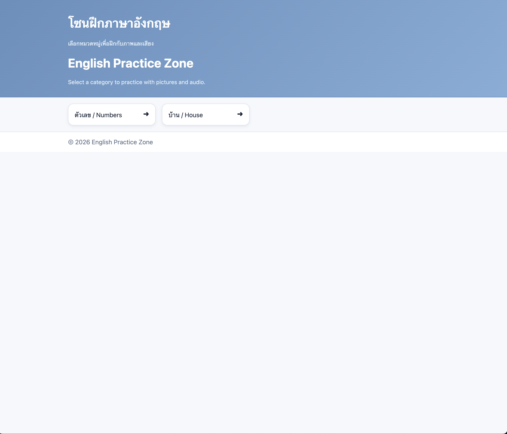
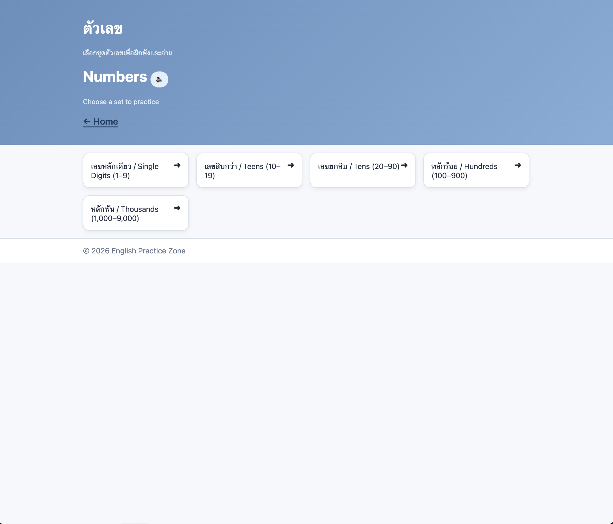
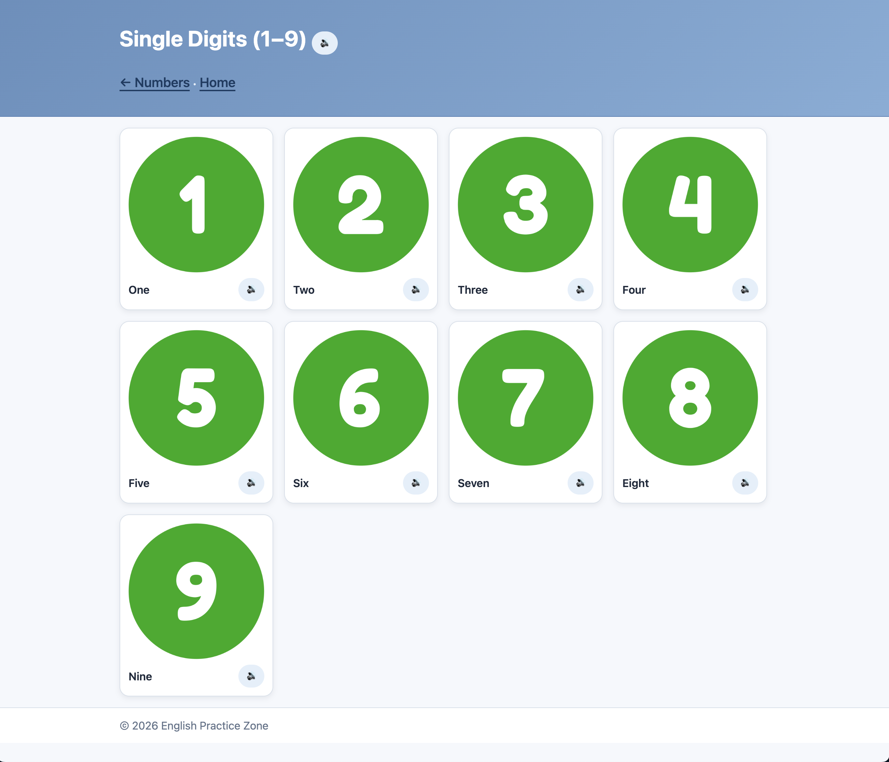
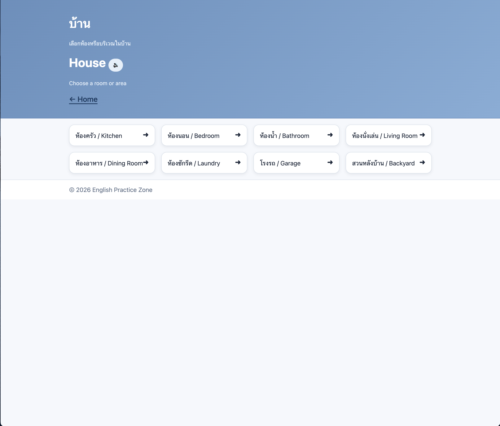
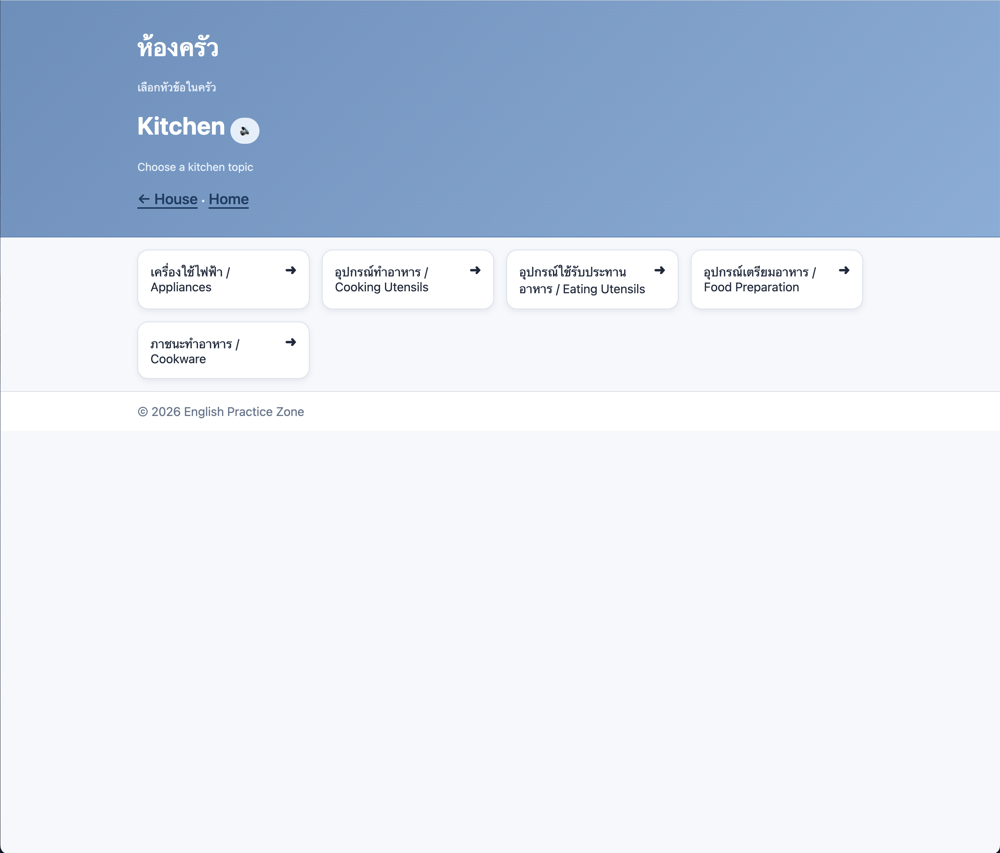
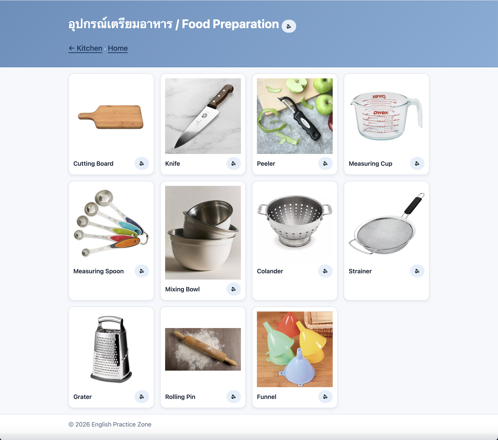

# English Practice Zone (Learn English Together)

## Overview

English Practice Zone is a lightweight, browser-based vocabulary practice application designed for Thai speakers learning English.

The project combines images, English labels, and tap-to-play pronunciation audio to provide a simple vocabulary-learning experience. It is implemented as a static web application, keeping deployment portable and the architecture easy to understand.

The current public version intentionally exposes only complete vocabulary categories. Additional category content remains in the repository for future development but is not linked from the public homepage.

---

## Live Demo

https://jas812000.github.io/learn-english-together/

---

## Screenshots

The screenshots below demonstrate the completed, publicly available vocabulary lessons.

### Homepage


### Numbers


### Single Digits


### House


### Kitchen


### Food Preparation


---

## Features

- Image-based vocabulary cards
- Tap-to-play pronunciation audio
- Bilingual category navigation (Thai and English)
- Responsive card layout
- Static-site architecture with no backend dependency
- Automated validation of publicly reachable pages and assets

---

## Architecture Overview

The application uses a simple, static, content-driven architecture.

### Application Layer

- `index.html` serves as the entry point and public category selector.
- Category pages organize vocabulary into individual topics.
- Only completed categories are linked from the homepage.

### Presentation Layer

- HTML defines page structure and content.
- Shared CSS provides responsive layout and consistent presentation.

### Interaction Layer

Vanilla JavaScript handles pronunciation-audio playback and small UI interactions. No JavaScript framework or build system is required.

### Asset Organization

Vocabulary sets keep their media close to the pages that use them:

- `image/` contains PNG vocabulary images.
- `audio/` contains MP3 pronunciation files.

This keeps each vocabulary set self-contained and straightforward to extend.

### Data Model

Vocabulary items are defined in page-level JavaScript using small data structures containing the information needed to render each card, such as:

- Identifier or display word
- Image filename
- Audio filename

This approach favors transparency and simple content maintenance over additional abstraction.

---

## Error Handling

The shared JavaScript uses defensive interaction handling:

- Missing audio elements are ignored safely.
- Browser-rejected media playback is handled without an unhandled promise rejection.
- No external API or service is required for core functionality.

A failed interaction does not prevent the rest of the page from remaining usable.

---

## Running Locally

### Prerequisites

- A modern web browser
- Python 3

Start a local static server from the repository root:

```bash
python3 -m http.server 8000
```

Then open:

```text
http://localhost:8000/
```

Using a local server avoids browser restrictions that can occur when HTML files are opened directly from disk.

---

## Project Structure

```text
.
├── .github/workflows/    GitHub Actions CI
├── assets/               Shared CSS and JavaScript
├── lessons/
│   ├── published/
│   │   ├── House/        Published house vocabulary
│   │   └── Numbers/      Published number vocabulary
│   └── draft/            Unfinished vocabulary categories
├── docs/
│   └── screenshots/       Screenshots of published lessons
├── scripts/              Site-validation tooling
├── index.html            Public homepage
└── README.md
```

Published lessons are maintained in `lessons/published/`. Unfinished
vocabulary categories are organized separately in `lessons/draft/`.

Only published lessons are linked from the public homepage. Draft lessons
remain accessible through direct URLs when deployed to GitHub Pages; their
directory location does not prevent public access.

Screenshots of the completed lessons are stored in `docs/screenshots/`.

---

## Testing and Validation

Run the automated site validator locally:

```bash
python3 scripts/validate_site.py
```

The validator starts at the public homepage and traverses the site's reachable HTML pages. It checks for:

- Broken internal navigation links
- Missing referenced local assets
- Missing dynamically referenced vocabulary images
- Missing dynamically referenced pronunciation audio
- Invalid `<image>` elements

GitHub Actions runs the same validation automatically on pushes and pull requests.

The automated validator covers pages reachable from the public homepage.
Draft lessons are excluded from this release-level validation until they
are ready for publication.

A separate structural check confirmed that all 103 draft HTML pages have
valid local navigation and asset references, apart from 60 outstanding
pronunciation recordings. Those recordings remain future development work.

Manual browser testing is also used to verify visual layout, navigation, and pronunciation playback behavior that static validation cannot fully exercise.

---

## What This Project Demonstrates

- Static web application organization
- HTML, CSS, and vanilla JavaScript
- Media-driven user interaction
- Responsive interface design
- Defensive browser-side interaction handling
- Automated content and asset validation
- GitHub Actions continuous integration
- Scope control by exposing only complete features

---

## Future Development

The current release focuses on the completed and publicly available vocabulary
categories. Future development may expand the application in the following areas:

### Bilingual Vocabulary Support

- Add Thai translations to vocabulary cards.
- Display Thai characters alongside the English vocabulary.
- Add separate English and Thai pronunciation controls.
- Add Thai-language audio assets.
- Improve accessibility labels for language-specific audio controls.

### Content Expansion

- Complete and publish additional vocabulary categories incrementally.
- Require images, vocabulary text, pronunciation audio, navigation, and validation
  to be complete before exposing a category publicly.

### Application Architecture

- Move vocabulary content toward a structured data model containing:
    - English vocabulary
    - Thai translation
    - English audio
    - Thai audio
    - Image
- Generate vocabulary cards from structured data rather than duplicating content
  throughout individual pages.

### Learning Features

After the vocabulary library is sufficiently developed:

- Flashcard practice
- Image-to-word quizzes
- Listening exercises
- Randomized vocabulary practice
- Progress tracking

### Quality and Accessibility

- Expand automated validation as additional categories become public.
- Maintain keyboard-accessible controls.
- Add descriptive accessibility labels to pronunciation controls.
- Perform broader Chrome, Safari, Firefox, desktop, and mobile testing.

---

## License

This project is licensed under the MIT License. See [LICENSE](LICENSE) for details.
